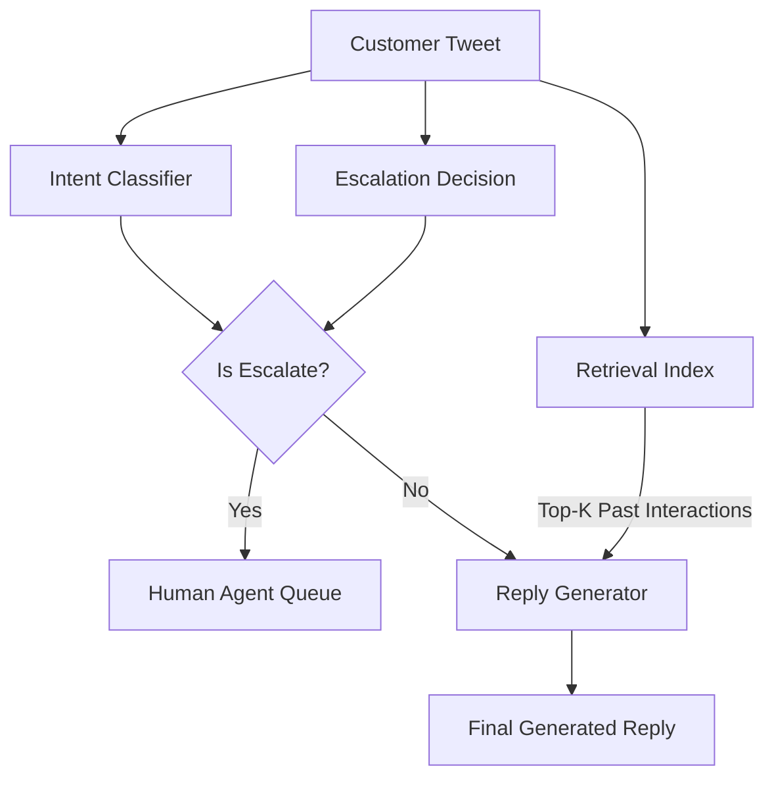

# System Design: Hiver Support Agent

This document outlines the architecture and components of the Hiver Support Agent designed to handle AmazonHelp customer inquiries.

## Architecture Overview

The system is designed as a Retrieval-Augmented Generation (RAG) pipeline combined with explicit routing and escalation logic. 

## Core Components

### 1. Intent Classifier (`src/intents/classifier.py`)
- **Type**: Zero-shot LLM prompt.
- **Function**: Categorizes the incoming customer text into one of 7 predefined intents (e.g., `MISSING_PACKAGE`, `DELIVERY_DELAY`, `ACCOUNT_PAYMENT_ISSUE`).

### 2. Escalation Logic (`src/escalation/decision.py`)
- **Type**: Zero-shot LLM prompt.
- **Function**: Determines if an issue requires human intervention based on severity and security requirements (e.g., refunds or secure account access).
- **Output**: Boolean `should_escalate` and a string `escalation_reason`.

### 3. Retrieval Index (`src/retrieval/index.py`)
- **Type**: In-memory Jaccard Similarity Search.
- **Function**: Tokenizes the incoming customer tweet and searches a historical database of 30,000 processed interactions (`amazonhelp_threads.parquet`) to find the top K=2 most similar past interactions.

### 4. Grounded Reply Generator (`src/reply/generator.py`)
- **Type**: Few-shot LLM generation.
- **Function**: Constructs a prompt using the customer's text and the retrieved historical examples to generate a polite, brief, and brand-aligned response.

### 5. Evaluation Harness (`src/eval/run_eval.py`)
- **Type**: LLM-as-a-Judge.
- **Function**: Evaluates the generated replies against human "ideal replies" on a scale of 1 to 5, generating a score and a reasoning trace for quality assurance.
